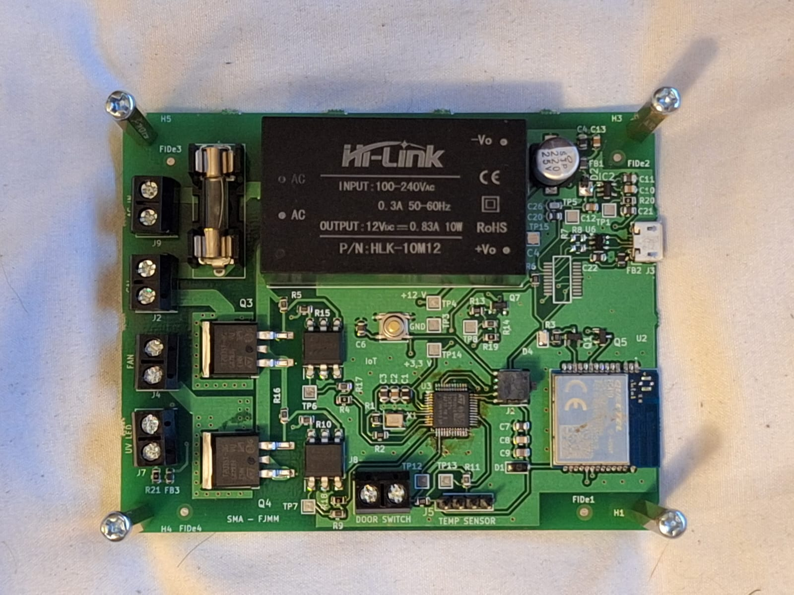

# 🌱 The Germinator — Smart Seed Germination System

> **Español:** The Germinator es una germinadora de semillas inteligente desarrollada como proyecto final de la materia de Internet of Things en la Escuela de Ingeniería de Antioquia (EIA). El sistema monitorea y controla temperatura, humedad y luz para optimizar la tasa de germinación en distintos tipos de semillas.

---

## 📖 Overview

The Germinator is an IoT-based smart germination chamber designed to maximize seed germination rates by continuously monitoring and controlling key environmental variables:

| Variable | Sensor | Actuator |
|---|---|---|
| 🌡️ Temperature | DHT11 | Fan (ventilation control) |
| 💧 Humidity | DHT11 | — |
| 💡 Light | LDR | Lamp (light control) |

The system collects real-time sensor data, transmits it over WiFi via MQTT, stores it in a SQL database, and visualizes it through a live Grafana dashboard — enabling continuous and remote monitoring of the germination environment.

---

## 🏗️ System Architecture

```
┌─────────────────────────────────┐
│        Germination Chamber      │
│                                 │
│  [DHT11] ──┐                    │
│  [LDR]   ──┤── STM32 + WiFi ───────────► MQTT Broker
│            │       │            │
│          [Fan]  [Lamp]          │
└─────────────────────────────────┘
                                        │
                              ┌─────────▼──────────┐
                              │   MQTT Subscriber   │
                              │     (Python)        │
                              └─────────┬──────────┘
                                        │
                              ┌─────────▼──────────┐
                              │    SQL Database     │
                              └─────────┬──────────┘
                                        │
                              ┌─────────▼──────────┐
                              │  Grafana Dashboard  │
                              │  (Live Monitoring)  │
                              └────────────────────┘
```

---

## 🔧 Hardware

### Electronics
- **Microcontroller:** STM32 + WiFi module
- **Sensors:** DHT11 (temperature & humidity), LDR (ambient light)
- **Actuators:** DC fan, lamp
- **Custom PCB:** Designed from scratch following electronic design rules

### PCB Manufacturing Process
1. Schematic design and PCB layout in KiCad
2. Component selection and Bill of Materials (BOM)
3. Assembly using **pick and place** machine
4. Solder reflow in **reflow oven**

---

## 🌐 Software & IoT Stack

| Layer | Technology |
|---|---|
| Firmware | STM32 (C/C++) |
| Communication | WiFi + MQTT |
| Data pipeline | Python (MQTT subscriber) |
| Database | SQL |
| Visualization | Grafana |

---

## 📁 Repository Structure

```
the-germinator/
├── backend/
│   ├── mqtt/
│   │   ├── index.js
│   │   └── package.json
│   └── sql/
│       └── germinator.sql
├── docs/
├── firmware/
│   └── stm32/
│       ├── Inc/
│       │   ├── credentials.example.h
│       │   ├── PINS.h
│       │   ├── dht11_nonblocking.h
│       │   ├── main.h
│       │   ├── stm32c0xx_hal_conf.h
│       │   └── stm32c0xx_it.h
│       └── Src/
│           ├── FC41/
│           ├── STATES/
│           ├── UART/
│           ├── publoop/
│           ├── timer/
│           ├── main.c
│           └── dht11_nonblocking.c
├── grafana/
│   └── GerminatorDashboards.json
├── hardware/
│   ├── bom/
│   ├── datasheets/
│   └── pcb/
│       ├── PCB.pdf
│       ├── Schematics.pdf
│       └── pcb_print.pdf
├── media/
│   ├── photos/
│   │   ├── grafana_dashboard.png
│   │   └── mounted_pcb.jpeg
│   └── videos/
│       └── the_germinator.mov
└── tools/
    └── simulator/
        └── mqtt_publisher.js
```

---

## 🚀 Getting Started

### Prerequisites
- [Node.js](https://nodejs.org/) (v18 or higher)
- [Mosquitto](https://mosquitto.org/download/) — MQTT broker installed locally
- [MAMP](https://www.mamp.info/) — to run MySQL locally
- STM32CubeIDE — to flash the firmware

### 1. Clone the repository
```bash
git clone https://github.com/tu-usuario/the-germinator.git
cd the-germinator
```

### 2. Configure environment variables
```bash
cd backend/mqtt
cp .env.example .env
# Edit .env with your credentials
```

### 3. Install Node.js dependencies
```bash
npm install
```

### 4. Start MAMP and import the database
- Open MAMP and start the servers
- Go to `http://localhost/phpmyadmin`
- Create a database called `germinator`
- Import `backend/sql/germinator.sql`

### 5. Start the Mosquitto broker
```bash
mosquitto
```

### 6. Start the MQTT subscriber
```bash
node index.js
```

### 7. Flash the firmware
- Open the `firmware/stm32/` project in STM32CubeIDE
- Copy `Inc/credentials.example.h` to `Inc/credentials.h` and fill in your WiFi and MQTT credentials
- Build and flash to the STM32 board

### 8. Open Grafana
- Import `grafana/GerminatorDashboards.json` into your Grafana instance
- Connect it to your local MySQL database
---

## 📸 Gallery

### PCB


### Grafana Dashboard


---

## 👥 Team

| Name | Role |
|---|---|
| **Felipe Mercado Mercado** | Hardware design, firmware, IoT integration |
| **Samuel Muñoz Arias** | Hardware design, firmware, IoT integration |

**Academic advisor:** José Valentín Antonio Restrepo Laverde
**Institution:** Escuela de Ingeniería de Antioquia (EIA)
**Course:** Internet of Things
**Year:** 2025

---

## 📄 License

This project is licensed under the MIT License — see the [LICENSE](LICENSE) file for details.

---

*Made with 🌱 at EIA — Escuela de Ingeniería de Antioquia*
